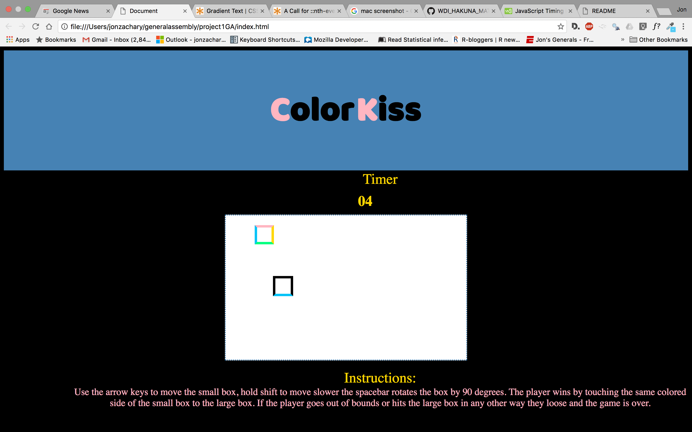

# project1GA
###ColorKiss 
Color is kiss is a colorful browser basewd game that pits the player against the timer. In order to win the player must match the side of the box he controls with the side of the other box of the same color! That's a mouthfull but it's easier if you just jump in and play! The version presented here is a proof of concept that simplifies the intended game elements. In the final version I hope to have 4 colored boxes and potentially more obstacle boxes.

  

##[Play it here](https://jon-zachary.github.io/project1GA/)
